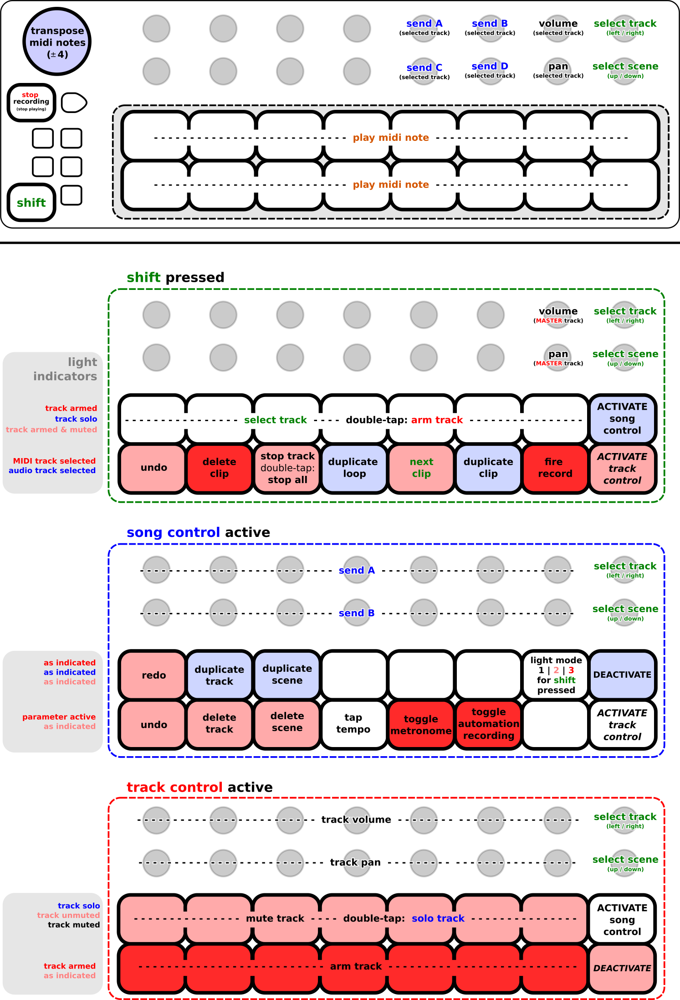

# Arturia BeatStep  +  Ableton Live 10

This is a **MIDI Remote Script** for **Ableton Live 10** and the **Arturia BeatStep** controller.  
It is intended to provide **full control** over **Ableton Live** directly via the **BeatStep** controller e.g.:

- arm / mute / solo / start / stop / record / delete / duplicate / overdub / undo / redo / ... 

- get indications on the status of tracks and scenes via button-lights

- ... and of course, at the same time ...  
  use the controller to play midi instruments with access to the **full range** of midi-notes!

Any comments / suggestions for improvements etc. are highly welcome!    

> Just drop an Issue and I'll see what I can do!

# Summary of Assignments

# Installation

To use this script, simply copy the contents into a folder named **"Beatstep_custom"** within the MIDI Remote scripts folder of Ableton Live (located at `..install-dir..\Resources\MIDI Remote Scripts`) and then select the **Beatstep_custom** device as control-surface in the MIDI-tab of the preferences. 
(make sure to activate both `track`and `remote` for this device!)

# 

# More detailed explanations on the assignments:

## Buttons:

The stop-button serves as `shift-button` to activate the control-features.  
`shift` + `button 8` and `shift` + `button 16` is used to activate different control-layers.   
(the control-layers remain activated until the button is pressed again!)  
The `transpose-slider` transposes the note-assignments of the buttons.

## Encoder:

- `encoder 8` : track-selection (left-right)

- `encoder 16` : scene selection (up-down)

- `encoder 5, 6, 13, 14` : send A, B, C, D of selected track

- `encoder 7` : volume of selected track

- `encoder 15` : pan of selected track

--- 

### If **shift (e.g. the stop-button)** is pressed:

The lights in the first row indicate the track-arm status: 
`blue` if the track can be armed and is **not **muted

- `red` if the track is armed and **not** muted 

- `magenta` if the track is armed but muted

- `off` if the track is muted and **not** armed

The lights in the second row are just there to help remembering the assignments.  
(you can turn the lights on/off ! >> check `"scene control" + button 7`)

The assignments are as follows:

- `shift` + `button 1-7`:  select track 1-7 of the currently focussed slots (red box)
  
  - double tap an already activated track to arm/unarm it !

- `shift` + `button 9`: undo

- `shift` + `button 10`: delete selected clip

- `shift` + `button 11`: stop selected clip
  
  - double-tap to stop all clips (and stop playing)!

- `shift` + `button 12`: duplicate the currently selected loop

- `shift` + `button 13`: move focus to the next clip (add an empty clip-slot if you are at the final slot)

- `shift` + `button 14`: duplicate the currently selected clip, and set the focus to the duplicate

- `shift` + `button 15`: start recording
  
  - if the currently selected slot is empty, start recording a new clip 
  
  - if a clip is already present, overdub

- `shift` + `button 8` : activate **song control** (see below)

- `shift` + `button 16` : activate **track control** (see below)

- 

- `encoder 8` : track-selection (left-right)

- `encoder 16` : scene selection (up-down)

- `encoder 7` : volume of master-track

- `encoder 15` : pan of master-track

---

### If "song control" is active

Most lights are simply there to help remembering the button-assignments.
The lights of `button 13` and `button 14` indicate the status of their corresponding parameter in Live 

- `red` for ON 

- `off` for off

The light of `button 7` indicates the visibility of the shift-button lights:

- `off` for no lights if `shift` is pressed

- `magenta` for only the top-row if `shift` is pressed

- `red` for all lights if `shift` is pressed

The assignments are as follows:

- `button 8` : get back to the normal behaviour (e.g. deactivate song control)

- `button 16`: switch to **track control**  (see below)

- `button 1` : redo last step

- `button 2` : duplicate currently selected track

- `button 3` : duplicate currently selected scene

- `button 7` : change what lights will turn on if shift is pressed
  
  - see the description of the lights of `button 7` above for details

- `button 9` : undo last step

- `button 10` : delete currently selected track

- `button 11` : delete currently selected scene

- `button 12` : tap tempo

- `button 13` : toggle metronome

- `button 14` : toggle session automation record
  
  

- `encoder 8` : track-selection (left-right)

- `encoder 16` : scene selection (up-down)

- the top-row of the encoders (`1-7`) control "send A"

- the bottom-row of the encoders (`9-15`) control "send B"

---

### If "track control" is active

The lights in the top-row indicate the mute / solo status of the corresponding track.

- `blue` for a track that is set to solo

- `magenta` for a unmuted track

- `red` if the track is both solo and muted

- `off` if the track is muted and not solo 

The lights in the bottom-row indicate the arm status of the corresponding track.

- `red` if the track is armed

- `off` if the track is unarmed
  
  

The assignments are as follows:

- `button 8` : switch to **song control** (see above)

- `button 16` : get back to the normal behaviour (e.g. deactivate track control)

- the buttons in the upper row (1-7) indicate / set the **mute** status of the first 7 tracks in the red box
  
  - holding `shift` while pressing the button will **solo** the corresponding track

- the buttons in the lower row (9-15) indicate / set the **arm** status of the first 7 tracks in the red box

- `encoder 8` : track-selection (left-right)

- `encoder 16` : scene selection (up-down)

- the top-row of the encoders (`1-7`) control the "track volume"

- the bottom-row of the encoders (`9-15`) control the "track pan"

---
